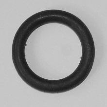
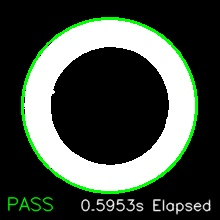
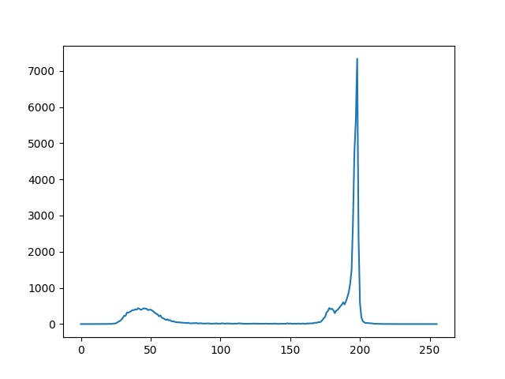

# Computer Vision Ring Fault Detection Algorithm
A computer vision algorithm for fault detection to determine whether or not a fault exists within a ring using raw image input and no external libraries such as OpenCV.

# Requirements
The following Python packages are required before using:
* OpenCV: https://pypi.org/project/opencv-python/
* NumPy: https://pypi.org/project/numpy/
* matplotlib: https://pypi.org/project/matplotlib/

All dependencies can be installed with the following command using `pip` in a shell terminal:
```
$ pip install opencv-python numpy matplotlib
```

# Usage
The application takes images from the input directory, parses them using the detection algorithm and outputs the given results to the command line, and also to an optional output directory that includes the total execution time, fault state, and histogram of the image itself.

## Image Input
The input images that need to be assessed should be placed in the [`ring_input`](./ring_input) directory, images should be grey-scaled such that the ring itself is black on a plain white background for best results.

## Starting The Process
The process can be started by executing the main [`detection.py`](./detection.py) program, with optional additional parameters:
```
$ python detection.py
```

__**Options**__
* `-t` Prevent verbose image output for every image that is processed.
* `-d` Enable a more detailed output for each image that is processed, includes additional data such as ring boundary values.

# Example
The process takes any image with a black ring and initially applies thresholding to the image to convert all cells of the image into black and white, from there the image is parsed using binary morphology and gets converted to display black on white pixels respectively.

<p align="center">
  
&nbsp; &nbsp; &nbsp; &nbsp;
  
</p>

With the boundary of the ring detected, a green or red border is displayed with connected component labelling along with the total execution time to process the image through the algorithm. Additionally, a histogram of the images findings is generated for further detailing on how the image was constructed using computer vision.

<p align="center">
  
</p>
